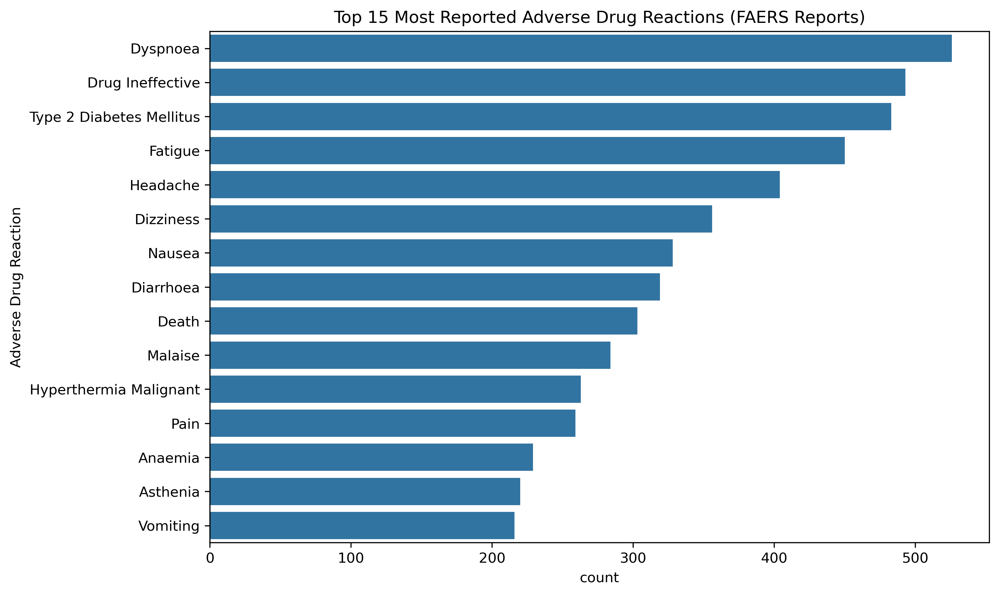
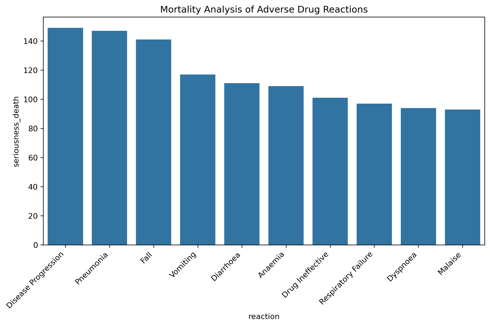
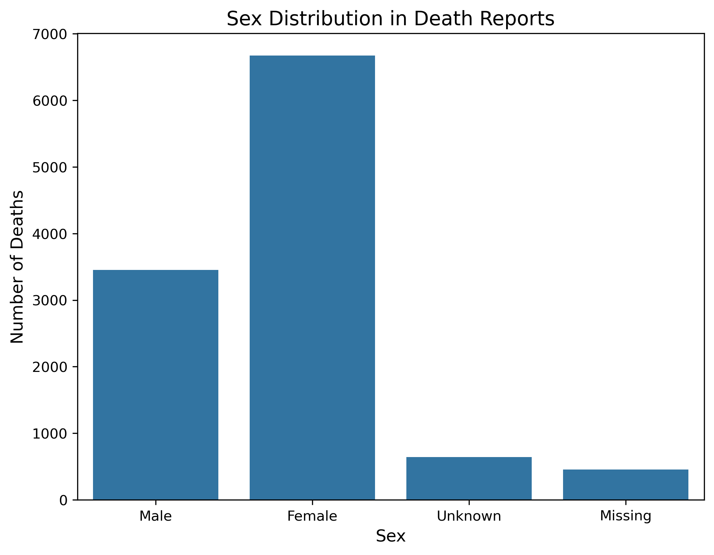
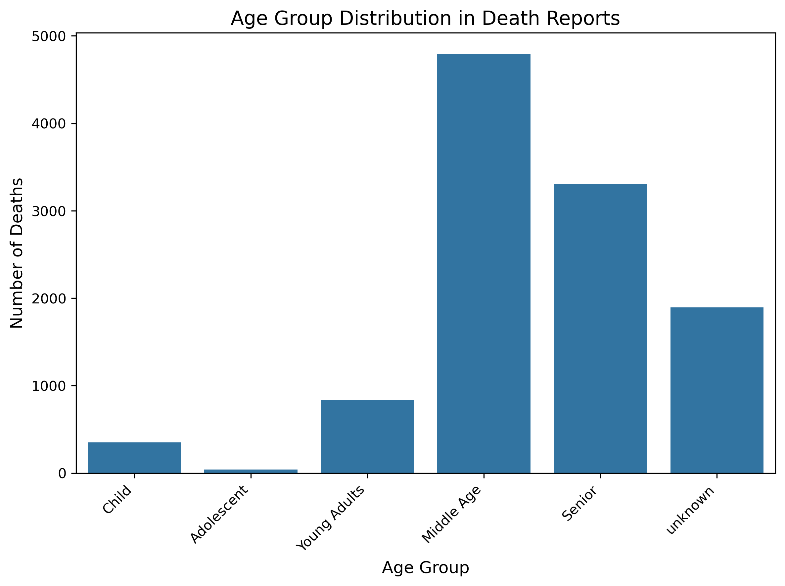

markdown
# 💊 Drug Side Effect Analysis (FAERS‑Style Dataset)

## 📌 Project Overview
This project analyzes adverse drug reactions using a **FAERS‑style dataset** (FDA Adverse Event Reporting System). The goal is to identify the most common side effects, high‑risk drugs, and mortality patterns across different age groups and sexes.

## 🔍 Key Findings
- **Mortality rate**: 9.72% of reports led to death.
- **Most dangerous drugs**: **Clozaril (Clozapine)** and **Kadcyla** had the highest death counts.
- **High‑risk groups**: 
  - **Females**: 59.4% of deaths.
  - **Middle Age (40‑65 years)**: More deaths than Seniors.
- **Common fatal reactions**: **Disease Progression** and **Fall** were the most frequent.
- **Data quality issue**: 33.5% of age data and 9.8% of sex data were recorded as `Unknown/Missing`.

## 📁 Drug Side Effect Analysis/
├── 📄 README.md
├── 📄 requirements.txt
├── 📄 Drug_Side_Effect_Analysis.ipynb
├── 📁 data/
│   └── 📄 drug_event_reports.csv
└── 📁 images/
    ├── 📄 Age Group Distribution in Death Reports.png
    ├── 📄 Dispersion of age in Fall reaction.png
    ├── 📄 Drug_reaction_plot.png
    ├── 📄 Mortality Analysis of Adverse Drug by Drugs.png
    ├── 📄 Mortality Analysis of Adverse Drug Reactions.png
    ├── 📄 Sex Distribution in Death Reports.png
    ├── 📄 Top 15 Adverse Drug Reactions by Age Group.png
    └── 📄 Top 15 Most Reported Adverse Drug Reactions.png


text

## 🚀 How to Run
1. Clone this repository:
   ```bash
   git clone https://github.com/your-username/drug-side-effect-analysis.git
Install the required libraries:

bash
pip install -r requirements.txt
Open and run the Jupyter notebook:

bash
jupyter notebook Drug_Side_Effect_Analysis.ipynb
📦 Dependencies
Python 3.x

pandas

numpy

matplotlib

seaborn

## 📊 Visualizations

### 1. Top 15 Most Reported Adverse Reactions


### 2. Mortality Analysis by Reaction


### 3. Sex Distribution in Death Reports


### 4. Age Group Distribution in Death Reports

⚠️ Limitations & Future Work
Missing data: A significant portion of age and sex data is missing, which may affect generalizability.

Future work:

Analyze drug‑drug interactions.

Apply machine learning models to predict fatal adverse reactions.

Use real SMILES data with RDKit for more accurate chemical analysis.

👤 Author
Mohammad Hooshmand – Pharmacy Student, Term 2

📎 Links
https://github.com/magury13851386/Drug-Side-Effect-Analysis

